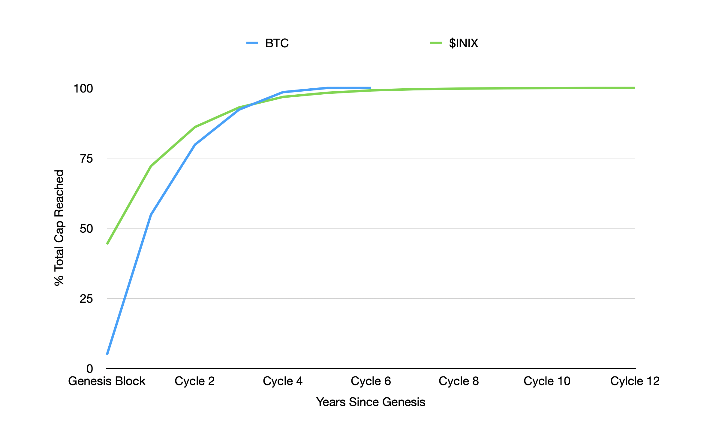

# 4.3 Minting Mechanism

This section discusses the inflation of Initium protocol by minting new $INIX tokens and its impact on the $INIX tokenomics. The principle of the Minting Mechanism of INITIUM is simple; reach a capped supply in a fashion similar to Bitcoin's emission curve and yet maintain the ability at which the protocol reaches this limit. The below chart shows the token emissions curve between $INIX and BTC.

### 4.3.1 Minting Mechanism

Minting (block rewards) in Initium protocol is designed to incentivize nodes to behave in a way that positively helps global outcomes. This is accomplished by the special _minting transactions_ and controlled by the Miniting Mechanism. A _prime_ node, a randomly elected node by the active nodes in the network, earns the right to mint a specific amount of $INIX predetermined in the Inflation Schedule. 90% of minted $INIX will be added to Staking Rewards Pool and distributed among the validators based on the staked $INIX and proof-of-uptime. Every node maintains local information about the liveness and behavior of each node, which is interacted. Whenever Node Y samples a node X, the latter retains a local tuple of response bit (a single bit representing whether X responds within the timeout) and timestamp (the time stamp of the response by the node X). Unlike the PoW, which is a costly and high energy-consuming process, the minting of $INIX is based on PoSync. This mechanism has significant consequences. In particular, a fair distribution of rewards among the network participants.&#x20;

### 4.3.2 Minting Mechanism Governance

The Minting Mechanism implements the Inflation Schedule. This is a protocol-based mechanism for increasing the Total Current Supply of $INIX during the Post-Genesis era. This mechanism determines the minting of new $INIX tokens as the block rewards for every cycle. Each cycle lasts four years, and every new cycle is subject to Halving.

&#x20;The `halving regula`, a Regula in the Constitution manages the `halving params`. The genesis block will mint 500M $INIX to relace the Pre-Genesis $INIX tokens. These tokens are called _Premined Tokens_, which construct 44.22% of the $INIX hardcap. During the Genesis Cycle, 72.11% of the maximum supply will be reached. By the end of the second cycle, 86.05%, by the end of the third cycle, 93.03%, by the end of the fourth cycle, 96.81%, by the end of the fifth cycle, 98.26%, and by the end of the sixth cycle, 99.13% of the hardcap will be reached.&#x20;

Although Initium Foundation expects the Initium community to keep these parameters stable, the `halving params` can be changed for the next cycle by the Covenant DAO. However, the new `halving params` cannot exceed the Genesis Cycle (the first cycle) and the previous cycle parameters.

The `halving regula` is the main variable for determining the `inflation schedule` Regula in the Constitution. This Regula is a permanent Regula that ensures the maximum cap of $INIX will not exceed the predetermined hardcap of 1,130,720,000 tokens.

### 4.3.2 Inflation Parameters

Three factors completely and uniquely parameterize the overall inflation rate of the $INIX token:

* **Initial Inflation Rate**: The starting _Inflation Rate_ for when inflation is first enabled. This rate results from minting new tokens in the first cycle (four years after the Genesis event). The token minting rate can only decrease from this point.
* **Dis-inflation Rate**: The rate at which the _Inflation Rate_ is reduced.
* **Long-term Inflation Rate**: The stable, long-term _Inflation Rate_ is expected.

### 4.3.3 Inflation Distribution&#x20;

The minting of new $INIX tokens (block rewards) significantly impacts the ecosystem. The new $INIX tokens are a substantial source of new resources for the Staking Rewards Pool and the Initium Foundation for developing the ecosystem and supporting the new projects. Based on a permanent Regula of the Constitution, the newly minted $INIX tokens (block rewards) will be distributed as follows:

* **Staking Rewards Pool**: 90% of the block rewards will be allocated to the Staking Rewards Pool.&#x20;
* **Initium Foundation**: 10% of the block rewards will be allocated to the Initium Foundation for supporting the ecosystem activities.

The next section (section [4.4](4.4-inflation-schedule.md)) discusses the projected scenario of how the $INIX token will reach the hardcap. Section [4.5](4.5-staking-mechanism.md) discusses the impact of the Inflation Rate on staking rewards and settings of a dynamic APY for $INIX stakings.&#x20;
