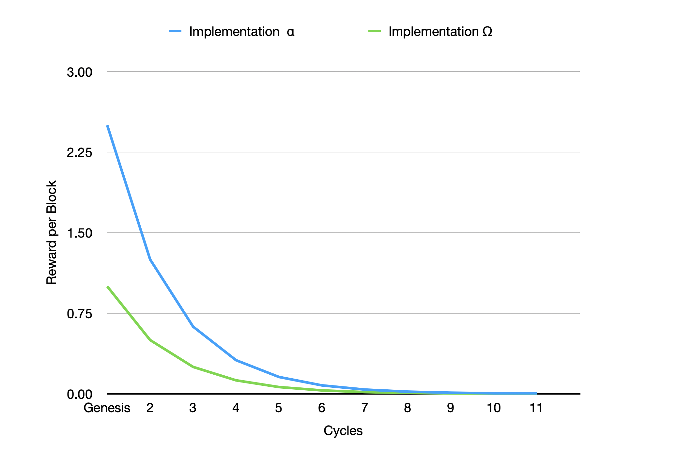

# 4.4 Inflation Schedule

The main parameter in the Minting Mechanism is the block rewards during a cycle. As mentioned above, each cycle lasts for four years. Each cycle has its _Regula_ for block rewards. This section discusses the default inflation schedule's predetermined block rewards for every cycle.&#x20;

### 4.4.1 Inflation Cycles

The first cycle begins with the Genesis Event, called Genesis Cycle, by which the block reward is set at the highest rate, which results in the Initial Inflation Rate. The new cycle will begin every four years, and the _Halving_ of block rewards will immediately be followed. Any change to the block reward can only be implemented after the Genesis Cycle by governance; otherwise, the Halving params will be implemented as default params in the genesis block.&#x20;

This mechanism will continue until the 10th cycle after the Genesis Event. The _Halving_ mechanism will halt at the 11th cycle, and the block reward in this cycle will be as same as in the 10th cycle. By end of the 11th cycle (the Golden Cycle), the final leptons will be mined, and the Initium network reaches the predetermined hardcap of 1,130,720,000 $INIX.

Depending on the final implementation of the Initium protocol, there are two scenarios for the Minting Mechanism which will have the same results. We consider two implementations of the Initium protocol as follows:

* Implementation α –– blocktime: 400ms, Genesis Cycle block rewards: 1.00 $INIX/block
* Implementation Ω –– blocktime: 1 second, block Genesis Cycle block rewards: 2.50 $INIX/block

The table below shows the block rewards during every cycle by implementation α.

|               |                     |                    |                       |
| ------------- | :-----------------: | :----------------: | :-------------------: |
| Period        | Block Reward (INIX) | Total Block Reward | Ending Current Supply |
| Pre-Genesis   |          0          |          0         |      500,000,000      |
| Genesis Cycle |          1          |     315,360,000    |      815,360,000      |
| Cycle 2       |         0.50        |     157,680,000    |      973,040,000      |
| Cycle 3       |         0.25        |     78,840,000     |     1,051,880,000     |
| Cycle 4       |        0.125        |     39,420,000     |     1,091,300,000     |
| Cycle 5       |        0.0625       |     19,710,000     |     1,111,010,000     |
| Cycle 6       |       0.03125       |      9,855,000     |     1,120,865,000     |
| Cycle 7       |       0.015625      |      4,927,500     |     1,125,792,500     |
| Cycle 8       |      0.0078125      |      2,463,750     |     1,128,256,250     |
| Cyccle 9      |      0.00390625     |      1,231,875     |     1,129,488,125     |
| Cycle 10      |     0.001953125     |     615,937.50     |    1,130,104,062.50   |
| Golden Cycle  |     0.001953125     |     615,937.50     |     1,130,720,000     |
| Cycle 12      |          0          |          0         |     1,130,720,000     |

&#x20; The table below shows the block rewards during every cycle by implementation Ω.

|               |                     |                    |                       |
| ------------- | :-----------------: | :----------------: | :-------------------: |
| Period        | Block Reward (INIX) | Total Block Reward | Ending Current Supply |
| Pre-Genesis   |          0          |          0         |      500,000,000      |
| Genesis Cycle |         2.5         |     315,360,000    |      815,360,000      |
| Cycle 2       |         1.25        |     157,680,000    |      973,040,000      |
| Cycle 3       |        0.625        |     78,840,000     |     1,051,880,000     |
| Cycle 4       |        0.3125       |     39,420,000     |     1,091,300,000     |
| Cycle 5       |       0.15625       |     19,710,000     |     1,111,010,000     |
| Cycle 6       |       0.078125      |      9,855,000     |     1,120,865,000     |
| Cycle 7       |      0.0390625      |      4,927,500     |     1,125,792,500     |
| Cycle 8       |      0.01953125     |      2,463,750     |     1,128,256,250     |
| Cyccle 9      |     0.009765625     |      1,231,875     |     1,129,488,125     |
| Cycle 10      |     0.004828125     |     615,937.50     |    1,130,104,062.50   |
| Golden Cycle  |     0.004828125     |     615,937.50     |     1,130,720,000     |
| Cycle 12      |          0          |          0         |     1,130,720,000     |

The chart below shows the block rewards curve in both implementations.&#x20;

### 4.4.2 Effective Inflation Rate

The inflation rate in the Initium network tends to zero by the end of the 11th cycle. In the first year, the effective inflation rate is about 15.77% which continues in the second year at 13.62%, the third year at 11.99%, and the fourth year at 10.70%.&#x20;

However, by the initiation of the second cycle, the inflation rate dramatically decreases to 4.83% and will be reduced to 4.22% in the last year of this cycle.&#x20;

In the third cycle, the inflation rate is around 2.03% and will be reduced to 1.91% in the last year of the cycle. In the fourth cycle, the inflation rate starts at 0.94% and will be reduced to 0.91% in the last year of this cycle. In the fifth cycle, the inflation rate starts at \~0.45% and will be kept roughly around 0.45%.

The chart below shows the effective inflation rate during the 11 cycles.&#x20;

