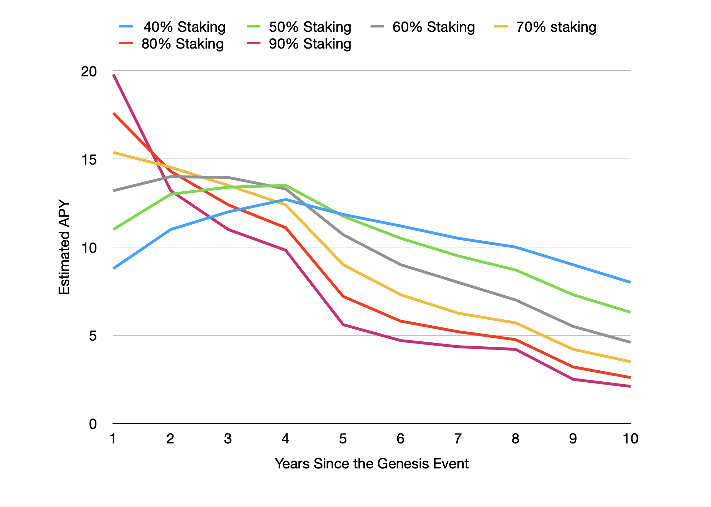

# 4.5 Staking Mechanism

By the Genesis Event in the Initium network, the mechanism for the staking rewards will change since the rewards will become protocol-based, and various factors will affect the obtained APY by the staking users. During this period, all $INIX tokens in the ecosystem are eligible to be staked and obtain APY.&#x20;

### 4.5.1 Staking Rewards Resources

The main channels of participant rewards remittances are the remained reserves of the Staking Rewards Pool from the Pre-Genesis, protocol-based rewards, and transaction fees.&#x20;

* Block Rewards: 90% of the block rewards will be sent to the Staking Rewards Pool.
* Transaction Fees: 50% of the transaction fees will be added to the Staking Rewards Pool.&#x20;

This mechanism creates a fair distribution of protocol-based rewards and transaction fees among the network participants.

### 4.5.2 Staking Participants

Generally, there are two significant participants for receiving staking rewards:

* **Validators**: these participants will receive staking rewards from the Staking Rewards Pool based on staked INIX, transaction fees (for the transactions they verify), block rewards (for the clusters they lead as Prime Node), and Supervision fees (from the Prime Nodes for the validator squads that they supervise).
* **Staking HODLers (Stakers)**: these participants will receive staking rewards from the Staking Rewards Pool based on staked INIX.&#x20;

### 4.5.3 Staking Methods&#x20;

There will be three main staking methods for the Post-Genesis period, including:

**1) Validator Staking Method (VMS)**

Everyone can run an Initium validator by meeting the validator requirements. Validators receive a significant reward compared to the other participants as they secure the network.&#x20;

**2) Assisted Staking Method (ASM)**

The participants who cannot run a validator can stake their INIX tokens with the validators. Validators that provide these services should have Certified Validator Badge from Initium Foundation. In this method, validators can offer various incentives to the participants for staking their INIX tokens. The assisted staking Method is profitable for both validators and participants since:

* Validators can increase their staked $INIX to become more eligible for being elected as _Prime_ or _Supervisor_ of the clusters and receive more transactions to verify in a _Validator Squad_.
* Participants can obtain more APY as their contributed validator obtains more rewards from the network.&#x20;

**3) Proxy Staking Method (PSM)**

Decentralized and centralized cryptocurrency exchanges, wallets, and other staking service providers can offer their staking plans for $INIX tokens. The providers of this staking method also need to run their validators or stake the $INIX tokens via ASM to be eligible to obtain staking rewards.&#x20;

### 4.5.5 Staking Rewards Calculation

The staking rewards are calculated in each epoch and distributed to the participants after the related epoch. The frequent unstaking during the epoch will significantly decrease the obtaining of rewards by the participants, which means increasing the staking $INIX will eventually result in more APY for the participants.

The key factors in calculations of staking rewards of a given participant are:

_Value Rate (_$$V_{epoch}$$_​)=_ refers to the rate of $INIX staked by all participants during an epoch _(_$$S_{epoch}$$_)_ to the Total Current Supply during a given epoch _(_$$C_{epoch}$$_)_ and is calculated as $$V_{epoch}=S_{epoch}/C_{epoch}$$.

_1) %INIX Staked (_$$Sp$$_​):_ refers to the percentage of $INIX staked by a given participant during an epoch ($$Sp_{epoch}$$) to the Total Current Supply during the epoch ($$C_{epoch}$$). % INIX Staked is calculated as $$Sp=(Sp_{epoch}/C_{epoch})*100$$.​

_2) Epoch Effective Rewarding Rate (_$$R_{epoch}$$_)_**:** refers to a measure for ensuring that a given participant's _S_ is reliable. If the participant frequently unstake/stake the $INIX during the epoch, this rate will decrease or increase. Epoch Effective Rewarding Rate as $$R_{epoch} = (Σ^n _{i=1} (S_{i})/n$$​, where:

* $$n$$ is the number times of changes in $$S_{i}$$​
* __$$S_{i}$$ _is the value of_ $$S$$ _every time it changes in_ $$n$$ _time_
* __$$_{i}$$ _variers from_ $$1$$ _to_ $$n$$__

For example, if a validator changes the$$S$$ for five times ($$_{n=5}$$) during an epoch ($$_{epoch}$$), then $$R_{epoch} = (Σ^5 _{i=1} (S_{1}+S_{2}+S_{3}+S_{4}+S_{5})/5$$.

_3) The Effective Epoch_ _(_$$e$$_)_: refers to the number of effective epochs during a calendar year. In the basic design of Initium, an epoch is valid for two days, however, this can be changed in network upgrades. Therefore, the Effective Epoch is applied to determine the staking rewards for each epoch. The Effective Epoch is calculated $$e=t/d_{epoch}$$ where $$t$$is the amount of seconds in a calendar year and $$d_{epoch}$$is the duration of an epoch in seconds.&#x20;

_4) Staking Rewards Pool Reserve during Epoch (_$$P_{ecoch}$$_):_ refers to the total $INIX tokens available on the Staking Rewards Pool during a given epoch.&#x20;

_5) Validator Uptime (_$$U_{epoch}$$_):_ refers to the rate by which a validator was uptime during the epoch. The proof-of-uptime mechanism variable will measure this variable. &#x20;

By considering the above, the staking rewards during a given epoch ($$x_{epoch}$$) will be calculated as $$x_{epoch}=((V_{epoch}*R_{ecoch}*P_{epoch})/e)*U_{epoch}$$

### 4.5.6 Prime and Supervisor Nodes Rewards

The _prime_ and _supervisor_ nodes are eligible to receive higher staking rewards in an epoch. The staking rewards mechanism will consider %50 more rewards for both _prime_ and _supervisor_ nodes. Since the election of these nodes is by the votes of the available nodes in the network, the nodes with higher proof-of-uptime and proof-of-responsiveness (Proof of Synchronization) have a higher chance of being elected as the prime and supervisor nodes of a given cluster.&#x20;

This mechanism encourages the nodes to be always active to have a higher chance of being elected as _prime_ and _supervisor_ nodes and eventually receiving higher staking rewards. In the meantime, since the election of these nodes is by the validators' votes, there is no "[rich-get-richer](../appendixes/terminology.md#rich-gets-richer)" compounding effect.&#x20;

### 4.5.7 Dynamic APY

The dynamism of staking rewards calculations (discussed in [section 4.5.5](4.5-staking-mechanism.md#4.5.5-staking-rewards-calculation)) makes the APY of staking rewards a dynamic rate that is highly affected by the total $INIX staked by the participants during an epoch ($$ΣS_{epoch}$$). For example, if we consider that at a given epoch, the Total Current Supply is 600M,  the user has staked 1M,  40% of the Total current Supply is staked by all participants ($$S_{epoch}$$), and the $$R_{epoch}$$ is 120M $INIX, then the $$x_{epoch}$$ for that given user will be about 439 $INIX. However, if the $$S_{epoch}$$ increase to 50%, the $$x_{epoch}$$ will increase to about 545 $INIX, which increases the staking rewards by about %24.14% for that given user.

This mechanism encourages the users to participate in staking the $INIX tokens to (1) secure the network and (2) increase the APY during each epoch.&#x20;

The following chart illustrates the APY of staking rewards in the Post-Genesis by different staking rates of $INIX tokens.&#x20;

### 4.5.8 Important Considerations&#x20;

The staking rewards in Initium are designed to incentivize the participants to contribute to the network security by running their validators or assisting them in securing the network more. The APY rate for the staking rewards will be dynamic in Initium and depends on various factors, including:

* **Block Rewards**: the Inflation Mechanism will decrease the block rewards. This would decrease the new-minted $INIX tokens and lowers protocol-generated supplies for the Staking Rewards Pool. &#x20;
* **Transactions**: since 50% of the transaction fees are allocated to the Staking Rewards Pool, increasing the number of transactions per block would directly increase the staking rewards. Initium can handle several thousand transactions per second and can be improved by implementing new protocol upgrades.
* **Fee Structure**: at the time of writing this article, the Initium fee structure is based on a fixed fee structure and as low as 5000 leptons. However, it's proposed to implement the _Foedis_ fee model (discussed in [section 4.6](4.6-transaction-fees.md)), which can dynamically set the transaction fee based on its complexity. The Initium community also can decide on transaction fees to provide more incentives to the participants.&#x20;
* **The number of validators**: the increasing number of validators can decrease the time of the epoch, which can increase the ROI of all validators as it decreases the effect of $$e$$ in the equation. This mechanism encourages the decentralization of the network by joining more validators to the network to secure it.&#x20;
* **Validators Uptime**: the staking rewards mechanism encourages the validator to be 100% uptime, as this affects their $$U_{epoch}$$.
* **Independent APY**: the increase in the staking rate of each participant will independently increase his APY in each epoch as it directly increases the effect of $$R_{epoch}$$ __ in the equation. It means every participant would have a different APY.&#x20;
* **Fair Context**: the staking reward mechanism creates a fair context for the users' participation in securing the Initium network to obtain the staking rewards in return. The users who effectively contribute to the $INIX tokens staking will be rewarded more. In the meantime, the loner staking, the higher rewards.&#x20;
* **Cooperation**: since the Proxy Staking Method providers also need to run their validators or cooperate with Initium Certified Valitodors, staking via these providers will make the network more secure and increase the ROI of validators. In the meantime, the increasing amount of staked $INIX tokens by all participants will increase the effect of $$V_{epoch}$$ in the APY of all participants.
* **Dynamic Rewards**: if, in any case, the participants receive lower rewards in a given epoch, as the new tokens will be added to Staking Rewards Pool based on the Inflation Schedule, they can receive higher rewards in the next epoch.&#x20;
* **Strategy**: the participants can conduct various staking strategies to increase their rewards.&#x20;

__
