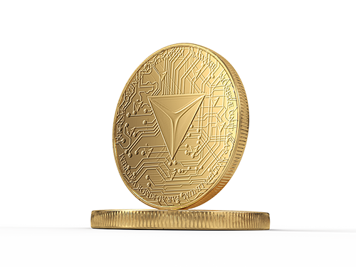

# 3.1 Introduction

$INIX has a capped-supply of 1,130,720,000 (1,130.72M) tokens. Lepton is the smallest denomination of $INIX. One lepton equals 0.000000000001 or $$10^{-12}$$  $INIX. One $INIX is $$10^{12}$$​leptons. Lepton is used to calculate the transaction fee on the Initium network.

The $INIX TGE will mint 500M $INIX tokens. This supply is called the Initial Supply, also known as the Total Current Supply during the Pre-Genesis era. The remaining 630,720,000 $INIX tokens will be minted during the Post-Genesis era according to the Inflation Schedule (section [4.4](../post-gen/4.4-inflation-schedule.md)) based on the Minting Mechanism discussed in section [4.3](../post-gen/4.3-minting-mechanism.md). The minting mechanism is a permanent _Regula_ in the Initium Constitution.&#x20;

Section 3.2 discusses the distribution of the Initial Supply among the contributors to the Initium protocol, section 3.3 discusses the allocation of $INIX tokens to the sales events, section 3.4 discusses the allocations of Initial Supply to the ecosystem in detail, section 3.5 discusses the allocations to the Initium Team (Prime Team), and section 3.6 discusses the staking mechanism and the pertaining rewards during the Pre-Genesis era.
