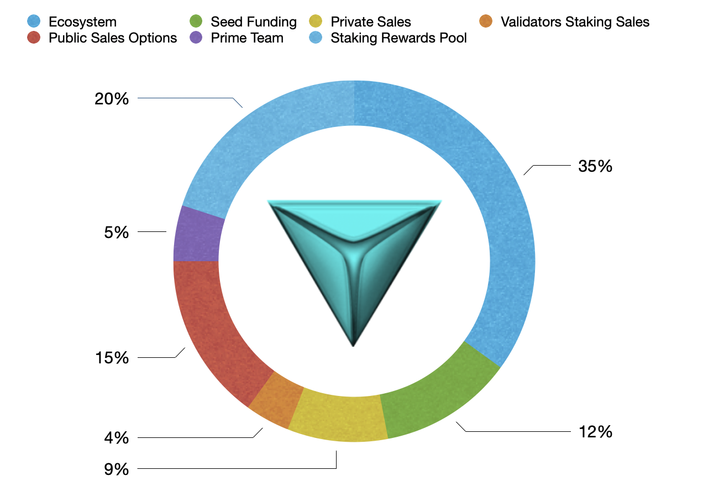

# 3.2 Initial Supply Distribution

The Initial supply of $INIX is 500M (five hundred million), which will be allocated as follows:

* Ecosystem Reserves: 35% equals 175M INIX&#x20;
* Seed Funding Sales: 12% equals 60M INIX
* Private Investors' Staking Sales: 9% equals 45M INIX
* Validators' Staking Sales: 4% equals 20M INIX
* Public Sales Options: 15% equals 75M INIX
* Prime Team: 5% equals 25MINIX
* Staking Rewards Pool: 20% equals 100M INIX

The allocated $INIX supplies will be distributed to the HODLers by $INIX TGE.
