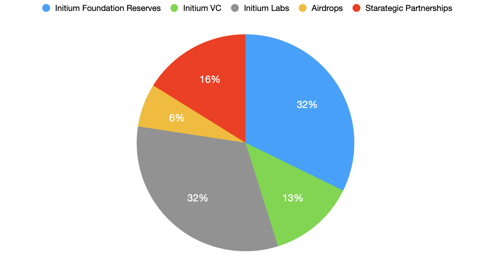

# 3.4 Ecosystem Allocations

This category refers to the allocated reserves to the Initium ecosystem, which covers various areas. 35% of the Initial Supply equals 175M $INIX is allocated for the building and extension of the Initium ecosystem.

### **3.4.1 Initium Foundation Reserves**

50M of 175M $INIX tokens of the Ecosystem Reserves will be allocated to the Initium Foundation as the fundamental organization of the ecosystem. Initium Foundation will manage and use these tokens for various ecosystem-building activities, including marketing, bounties, and incentive programs. The use of tokens will be transparent to the community in the Initium Foundation Transparency Reports.&#x20;

### **3.4.2 Initium** Ventures&#x20;

Initium Ventures is a venture capital fund managed by Denarius DAO. 20,000,000 of 175M $INIX tokens of the Ecosystem Reserves will be allocated to Initium Ventures. The Initium community will use these tokens to merge and acquire startups and platforms for the Initium ecosystem.

### **3.4.3 Initium Labs**

50M of 175M $INIX tokens of the Ecosystem Reserves will be allocated to the Initium Labs to build the Initium protocol and conduct the developers' incentive programs and events. The use of tokens will be transparent to the community in the Initium Foundation Transparency Reports.

### 3.4.4 **Strategic Partnerships**

20M of 175M **** $INIX tokens of the Ecosystem Reserves will be allocated to strategic partnerships. These partnerships include the investment and support of the Initium Foundation from special projects or enterprises building their businesses based on the Initium ecosystem. The Initium Foundation manages these tokens, and their usage will be transparent to the community in the Initium Foundation Transparency Reports.

### **3.4.5 Airdrops**

10M of 175M **** $INIX tokens of the Ecosystem Reserves will be allocated to airdrop programs conducted by the Initium Foundation to extend the community basis of the Initium ecosystem. Airdrop programs will be conducted during various Pre-Genesis and Post-Genesis era events. Initium Foundation may allocate additional tokens to the airdrop programs in the future (see [5.8](../schedule/5.7-airdrops.md))
