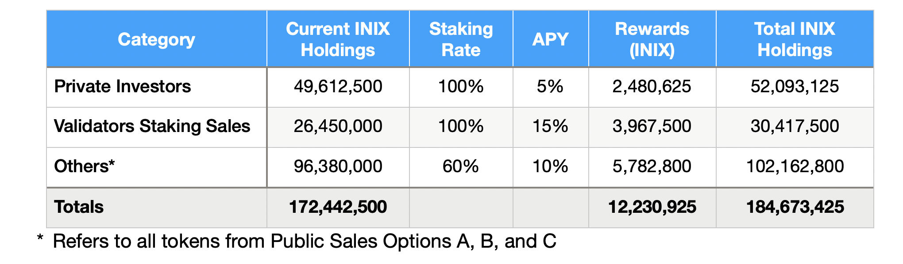

# 3.6 Staking Mechanism

The main channel of participants' rewards is the Staking Rewards Pool, with primary reserves of 100,000,000 $INIX allocated from the Initial Supply.

### 3.6.1 Eligible HODLers for Staking Rewards

During Pre-Genesis, the following %INIX HODLers are eligible to receive the staking rewards:

* **Private Sales' Investors**: as mentioned in Initial Supply Distribution, these HODLers' tokens are subject to 5% APY during the vesting period.&#x20;
* **Validators Staking Investors**: as mentioned in Initial Supply Distribution, these HODLers' tokens are subject to 15% APY during the vesting period.&#x20;
* **Public Sales Option A**: as mentioned in Initial Supply Distribution, these HODLers' tokens are subject to a 20% APY for the vesting period (12 months). Since these tokens will be unlocked after the vesting period, these HODLers can stake their INIX token on available pools to obtain rewards based on the regular APR.&#x20;
* **Public Sales Option B**: as mentioned in Initial Supply Distribution, these HODLers' tokens are subject to a 20% APY for the vesting period (18 months). Since these tokens will be unlocked after the vesting period, these HODLers can stake their INIX token on available pools to obtain rewards based on the regular APY.&#x20;
* **Public Sales Option C**: since these tokens are not subject to any vesting period, the HODLers of these tokens can stake their INIX token on available pools to obtain rewards based on the regular APY.&#x20;

### 3.6.2 Regular Staking APY

The regular APY for the Pre-Genesis period is 10%.&#x20;

### 3.6.3 Rewards Impact on Staking Rewards Pool

we expect that 60% of the unlocked $INIX tokens during the Pre-Genesis era to be staked for obtaining the rewards by the owners.

As shown in Table 1, during the first year, approximately 18,1500,000 $INIX will be distributed among the eligible HODLers.

In the second year, the following assumptions are considered:

* Tokens subject to Public Sales Option A are unlocked. The owners probably stake them with a 60% staking rate. We will consider them via tokens subject to Public Sales Option C as _Others_.
* Tokens subject to Public Sales Option B will still be locked for six months and eligible to receive 20% APY for this period. After unlocking, the owners may stake them with a 60% staking rate to obtain the regular APY.

As shown in Table 2, during the second year, approximately 14,292,500 $INIX will be distributed among the eligible HODLers.

In the third year, by assuming the 60% staking rate of tokens from Public Sales Options A, B, & C, it's estimated that approximately 12,230,925 $INIX to be distributed among all HODlers, as shown in Table 3.

Considering the above figures, we estimate that approximately 55,327,075 $INIX tokens, about 55.32% of the reserves of the Staking Rewards Pool in the Pre-Genesis period, will be distributed to the users.&#x20;
